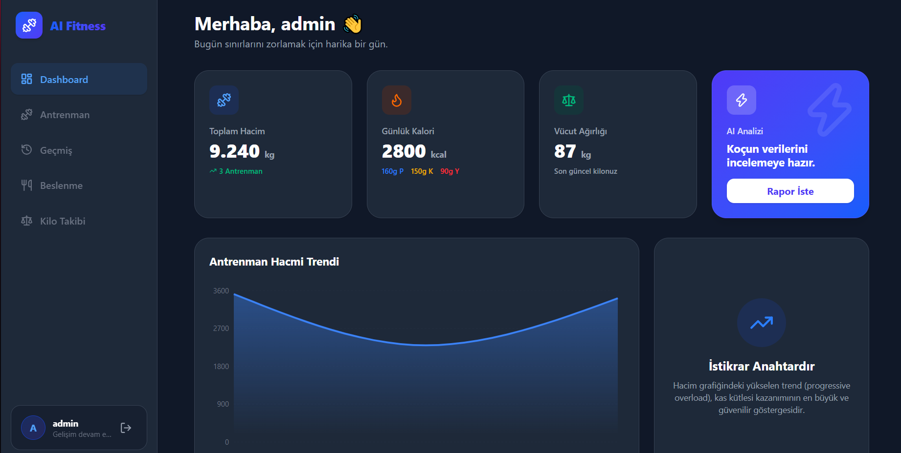
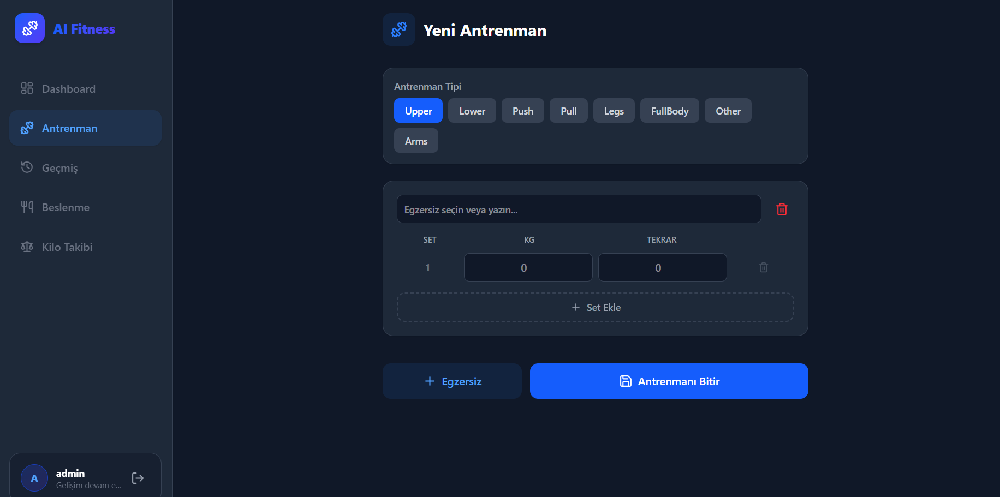
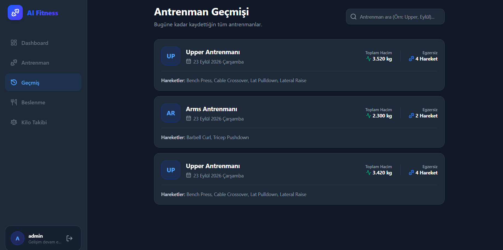
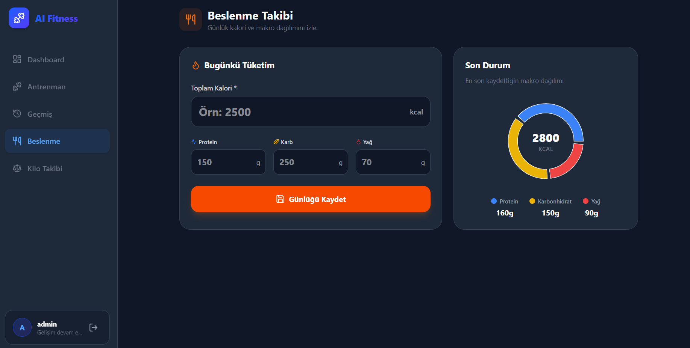
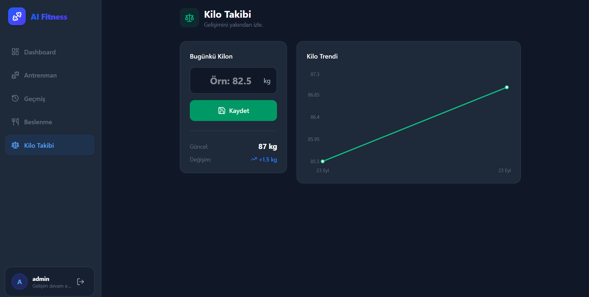

# 🏋️‍♂️ AI-Powered Fitness & Nutrition Tracker

Kişisel antrenman hacminizi (progressive overload), günlük makro/kalori tüketiminizi ve vücut ağırlığınızı takip edebileceğiniz; **Google Gemini AI** destekli akıllı bir vücut geliştirme asistanı.

## 📸 Ekran Görüntüleri

*(Projenin arayüzüne ait görseller)*

  
  
   
  
  
   
  

## ✨ Özellikler

- **🤖 Yapay Zeka Koçu:** Son antrenmanlarınızı ve beslenmenizi analiz ederek kas gelişimi, progressive overload ve toparlanma hakkında Gemini AI destekli özel raporlar sunar (Aynı bölge antrenmanlarını kıyaslama mantığıyla çalışır).
- **📊 Gelişmiş Dashboard:** Recharts entegrasyonu ile antrenman hacmi (volume) trendlerinizi grafiksel olarak izleyin.
- **🥩 Beslenme ve Makro Takibi:** Günlük kalori, protein, karbonhidrat ve yağ alımlarınızı kaydedin ve görselleştirin.
- **🏋️‍♂️ Antrenman Günlüğü:** Egzersizleri, setleri, tekrarları ve ağırlıkları kaydedin. Kişisel rekorlarınızı (PR) takip edin.
- **🔐 Güvenli Altyapı:** NextAuth ile kullanıcı doğrulama ve veritabanında (MongoDB) kullanıcıya özel izole veri yönetimi.

## 🛠️ Kullanılan Teknolojiler

- **Frontend:** Next.js (App Router), React, Tailwind CSS, Recharts, Lucide Icons
- **Backend:** Next.js API Routes, Node.js
- **Veritabanı:** MongoDB (Mongoose)
- **Yapay Zeka:** Google Generative AI (Gemini 3.5 / 2.5 Flash Lite)
- **Kimlik Doğrulama:** NextAuth.js (Bcrypt şifreleme)

## 🚀 Kurulum (Local Development)

Projeyi kendi bilgisayarınızda çalıştırmak için aşağıdaki adımları izleyin:

**1. Repoyu klonlayın:**
\`\`\`bash
git clone https://github.com/serkanoztas/ai-fitness-tracker.git
cd ai-fitness-tracker
\`\`\`

**2. Bağımlılıkları yükleyin:**
\`\`\`bash
npm install
\`\`\`

**3. Çevre Değişkenlerini (Environment Variables) ayarlayın:**
Ana dizinde bir `.env.local` dosyası oluşturun ve aşağıdaki bilgileri kendi verilerinizle doldurun:
\`\`\`env
MONGODB_URI=mongodb+srv://<kullanici_adi>:<sifre>@cluster.mongodb.net/fitnessApp
NEXTAUTH_SECRET=kendi_belirledigin_guvenlik_sifresi
NEXTAUTH_URL=http://localhost:3000
GEMINI_API_KEY=google_gemini_api_anahtarin
\`\`\`

**4. Geliştirme sunucusunu başlatın:**
\`\`\`bash
npm run dev
\`\`\`
Tarayıcınızda [http://localhost:3000](http://localhost:3000) adresine giderek uygulamayı görüntüleyebilirsiniz.

## 🌍 Canlı Yayın (Deploy)
Bu proje [Vercel](https://vercel.com/) üzerinde yayına alınmak üzere optimize edilmiştir. Vercel paneli üzerinden GitHub reponuzu bağlayıp ortam değişkenlerini (Environment Variables) girerek tek tıkla yayına alabilirsiniz.